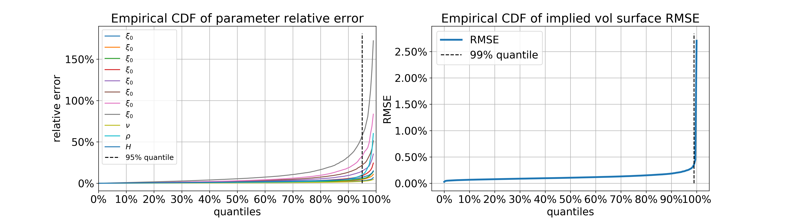

# NN-StochVol-Calibrations
We implement the paper Deep Learning Volatility A deep neural network perspective on pricing and calibration in (rough) volatility models available at: https://papers.ssrn.com/sol3/papers.cfm?abstract_id=3322085.

We provide easy-to-follow Ipython notebooks that show the simplicity and effectiveness of our methodology (no GPU's or fancy hardware needed).

The key contribution here is an implementation of a Neural Network framework to calibrate Stochastic volatility models, be it Markovian or not. We achieve an efficient Neural Network approximation of the implied volatility surface (see below)

 

and manage to handle term structures (curves) of forward variances and achieve remarkable calibration precision (see picture below).

 

