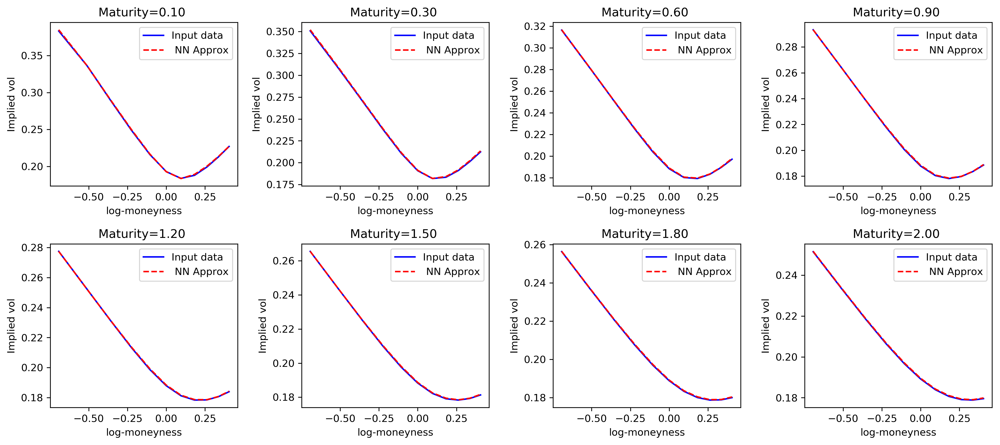

# NN-StochVol-Calibrations
We implement the paper Deep Learning Volatility A deep neural network perspective on pricing and calibration in (rough) volatility models available at: https://papers.ssrn.com/sol3/papers.cfm?abstract_id=3322085

The key contribution here is an implementation of a Neural Network framework to calibrate Stochastic volatility models, be it Markovian or not. We achieve an efficient Neural Network approximation of the implied volatility surface (see below)

 
